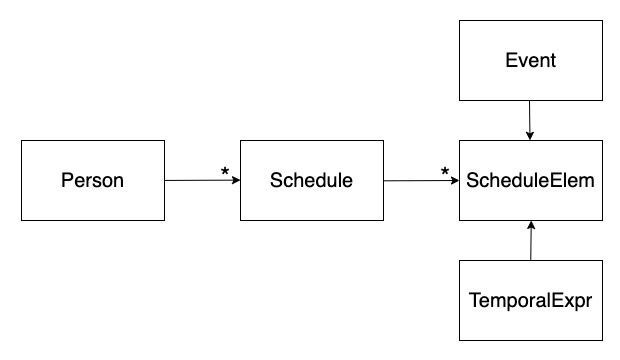
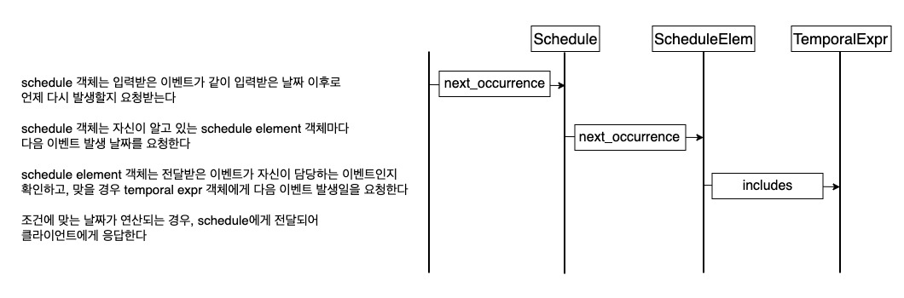
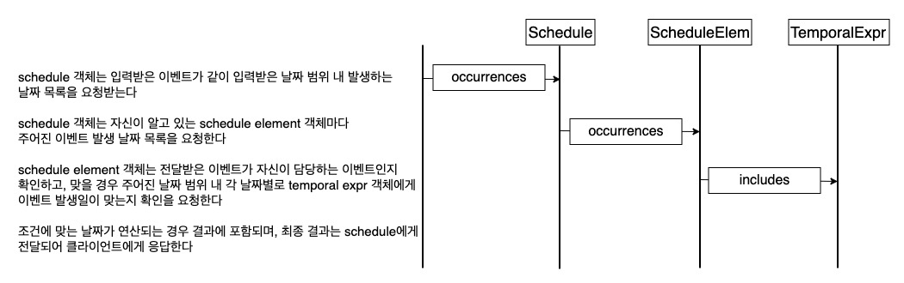

## 프로젝트 설명
- 이벤트 등록 시 반복 이벤트를 처리하는 모듈
- [Martin Fowler의 글](https://martinfowler.dev.org.tw/apsupp/recurring.pdf)에 나온 내용을 루비로 구현

## 프로젝트 진행 상황
- [x] 반복 이벤트 구현 (x번째 주, y요일에 발생하는 월 기준 반복 이벤트, 시작 월일부터 끝 월일까지 지속되는 연 기준 반복 이벤트)
- [x] 이벤트 관련 정보를 연산할 수 있는 메서드 정의
- [x] 여러 개의 반복 이벤트 조건을 조합해 하나의 반복 이벤트를 만들 수 있는 객체 정의

## 클래스 다이어그램

## 메서드별 흐름도

### is_occurring: 이벤트와 날짜를 입력받아 주어진 날짜에 이벤트가 발생하는지 확인한다

### next_occurrence: 이벤트와 날짜를 받아 주어진 이벤트가 주어진 날짜 다음으로 발생하는 날짜를 반환한다

### occurrences: 이벤트와 기간(시작 날짜, 끝 날짜)을 받아 주어진 이벤트가 기간 사이에 발생하는 날짜 목록을 반환한다

