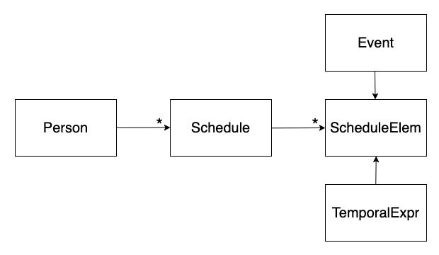
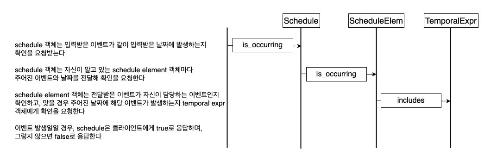
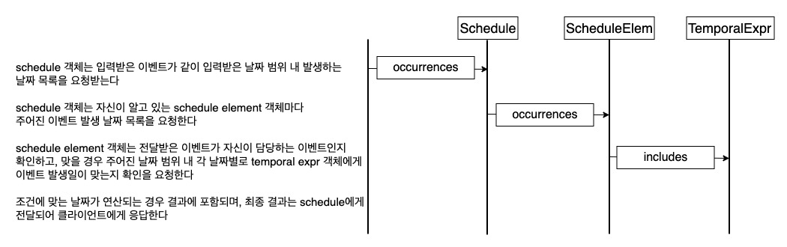

## 반복 이벤트 처리 모듈
- [notify-event 백엔드 애플리케이션](https://github.com/rogarithm/notify-event)에 쓸 목적으로 이벤트 등록 시 반복 이벤트를 처리하는 로직을 구현
- [Martin Fowler의 글](https://martinfowler.dev.org.tw/apsupp/recurring.pdf)에 나온 내용을 참고해 루비로 구현
- 루비로 먼저 구현 후 자바로 재구현할 예정

## 클래스 다이어그램

## 메서드별 흐름도

### is_occurring: 이벤트와 날짜를 입력받아 주어진 날짜에 이벤트가 발생하는지 확인한다

### next_occurrence: 이벤트와 날짜를 받아 주어진 이벤트가 주어진 날짜 다음으로 발생하는 날짜를 반환한다

### occurrences: 이벤트와 기간(시작 날짜, 끝 날짜)을 받아 주어진 이벤트가 기간 사이에 발생하는 날짜 목록을 반환한다

